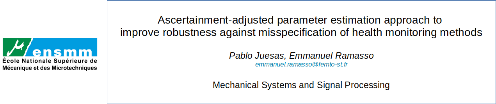

## Learning with soft weak partial labels in hidden Markov Models with discrete observations 

This is the implementation of [1], that is a partially hidden Markov model with discrete observations. 
Partially hidden, partially supervised, weakly hidden, weakly supervised, weak prior, soft labels, noisy labels, uncertain and imprecise labels, etc focus on taking account of a prior on the latent space, here for an D-HMM. 

The code provided allows to reproduce the results of the paper

## Getting Started

Add to path the local folders, then the following folders contain a main file to reproduce the results of the paper. 
1. `example 1 - ECM and doubt`
2. `example 2 - Simulated 2`
3. `example 3 - Turbofan datasets`

Folder `resultsPaper` contains the .mat obtained to make the figures. 
 
## Cite

If you make use of this code in your work, please refer to [1]:

```
@article{juesas2016ascertainment,
  title={Ascertainment-adjusted parameter estimation approach to improve robustness against misspecification of health monitoring methods},
  author={Juesas, Pablo and Ramasso, Emmanuel},
  journal={Mechanical Systems and Signal Processing},
  volume={81},
  pages={387--401},
  year={2016},
  publisher={Elsevier}
}
```
